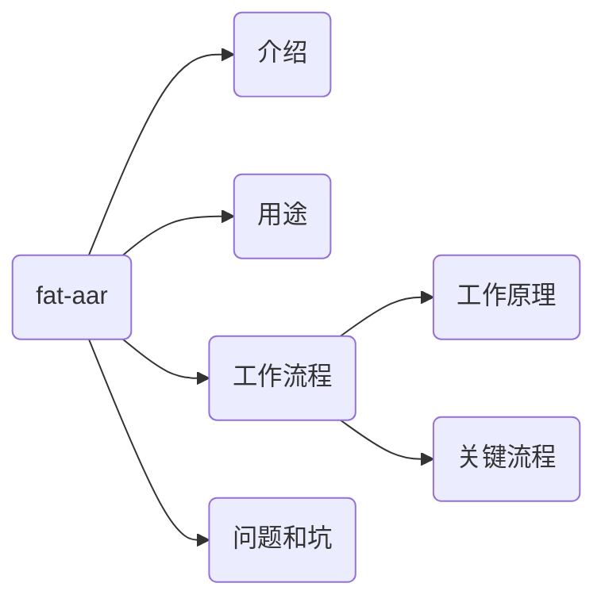

## fat-aar




## 介绍

[官方文档](https://github.com/adwiv/android-fat-aar)中是这样介绍fat-aar的：

> Gradle script that allows you to merge and embed dependencies in generted aar file

fat-aar是一个允许你合并和嵌入依赖关系到生成的aar文件的gradle脚本。

从fat-aar的用途来讲，它的主要工作就是将project中内部所依赖的aar下载到本地，然后一起发布aar到maven库，外部项目依赖aar时不用去下载project内部依赖的aar

### aar结构介绍

aar是Android Library Project的二进制文件包，文件的扩展名是aar，其实文件本身就是一个简单的Zip文件，解压后有以下几种类型，相信Android开发同学都不会陌生

- /AndroidManifest.xml（必须）
- /classes.jar（必须）
- /res/（必须）
- /R.txt（必须）
- /assets/（可选）
- /libs/*.jar（可选）
- /jni/<abi>/*.so（可选）
- /proguard.txt（可选）
- /lint.jar（可选）

备注：R.txt文件是aapt --output -text -symbols输出，aapt相关细节这里不再叙述

### fat-aar解决思路：合并aar


<center>
    
    <br>
    <div style="color:orange; border-bottom: 1px solid #d9d9d9;
    display: inline-block;
    color: #999;
    padding: 2px;">
      图1-改造前后对比
      </div>
</center>


如上图所示，我们把依赖的外部aar和内部module（可以看成aar）输出的N个aar文件进行合并，这样原来A模块的调用者接入方式保持不变，而且在依赖A时不必再重新下载A内部依赖的其他aar，可以提供给外部项目使用而避免访问远程maven库的场景

参考上面aar包结构形式，fat-aar合并主要过程为：

- 合并Manifest
- 合并jar
- 合并res资源
- **合并R文件**（最关键的一步）
- 合并assets
- 合并libs
- 合并jni
- 合并Proguard


## 什么场景下需要fat-aar？

### 发布一个aar时，你可能需要它

我们发布aar时，会带有一个`aarName-x.x.x.pom`文件(`aarName`是`aar`的名字，`x.x.x`是版本号)，这个`pom`文件里面定义了我们aar内部依赖的aar，外部project依赖该aar会在编译时去下载其内部依赖的`aar`;**对外发布的aar中如果有依赖内网maven库中的aar**，会因无法连接内部maven库导致下载内部aar失败，最终编译失败。

所以在这里引入fat-aar解决方案，在对外发布aar时将其内部依赖的aar全部下载到本地，发布时一起打包进去，外部project在编译时不用去内部maven库下载

### 引用多个aar时，你可能需要它

当我们引用到多个外部`aar`如`a`、`b`、`c`三`个aar`的时候，需要对其统一管理，则需要建立一个`lib-base.aar`，让`base`合并``a`、`b`、`c`的内容，这样我们只需要依赖`lib-base.aar`，就可以让主工程分离多``a`、`b`、`c`的依赖。

## fat-aar接入流程

### Step 1

下载`fat-aar`文件到本地项目`module`下，然后在`build.gradle`中依赖`fat-aar.gradle`

```groovy
apply from: 'fat-aar.gradle'
// 或者
apply from: 'https://raw.githubusercontent.com/adwiv/android-fat-aar/master/fat-aar.gradle'
```

### Step 2

将需要下载的内部`aar`或本地`lib`的`compile`替换成`embedded`，`embedded`是`fat-arr`内部定义的一个属性

```groovy
dependencies {
  compile fileTree(dir: 'libs', include: ['*.jar'])
  
  embedded project(':librarytwo')
  embedded project(':libraryone')
  embedded 'com.example.internal:lib-three:1.2.3'
  
  compile 'com.example:some-other-lib:1.0.3'
  compile 'com.android.support:appcompat-v7:22.2.0'
}
```

### Step 3

将embedded依赖的project在对外发布aar时从pop.xml文件中去掉，避免外部依赖时再次下载，参考fat-aar下面的 [publish.gradle](https://github.com/adwiv/android-fat-aar/blob/master/publish.gradle)，当然也可以自己实现

## fat-aar工作原理

`fat-aar`工作原理

`fat-aar`主要思路就是合并`aar`，根据`aar`的文件结构，可划分为多个子任务

首先了解一下gradle构建流程，gradle执行主要分为三个过程：

- Initialization（初始化阶段）：分析有哪些module将要被构建，为每个module创建对应的project实例，settings.gradle文件会被解析
- Configuration（配置阶段）：处理所有模块的build脚本，处理依赖、属性等，配置执行完后，有一个很重要的回调afterEvaluate，表示所有的模块都配置完了，可以执行task了
- Execution（执行阶段）：根据task链表来执行某一个特定的task，这个task所依赖的其他task都将会被提前执行

fat-aar就是在配置阶段完成进入afterEvaluate回调中，然后执行合并内部依赖aar的操作，我们在对外发布aar时需要定义Task uploadArchives（如何上传aar至maven请自行了解），而uploadArchives内部依赖assembleRelease执行结果

### Step1寻找

首先，根据定义的`embedded`属性找出需要合并的`aar`，并将`aar`解压到相应目录下（注意`gradle tools`版本影响，建议设置为`2.2.3`）

```groovy
def dependencies = new ArrayList(configurations.embedded.resolvedConfiguration.firstLevelModuleDependencies)
dependencies.reverseEach {

    def aarPath;
    if (gradleApiVersion >= 2.3f)
        aarPath = "${root_dir}/${it.moduleName}/build/intermediates/bundles/default"
    else
        aarPath = "${exploded_aar_dir}/${it.moduleGroup}/${it.moduleName}/${it.moduleVersion}"
    it.moduleArtifacts.each {
        artifact ->

            println "ARTIFACT 3 : "
            println artifact
            if (artifact.type == 'aar') {
                if (!embeddedAarFiles.contains(artifact)) {
                    embeddedAarFiles.add(artifact)
                }
                if (!embeddedAarDirs.contains(aarPath)) {
                    if( artifact.file.isFile() ){
                        println artifact.file
                        println aarPath

                        copy {
                            from zipTree( artifact.file )
                            into aarPath
                        }
                    }
                    embeddedAarDirs.add(aarPath)
                }
            } else if (artifact.type == 'jar') {
                def artifactPath = artifact.file
                if (!embeddedJars.contains(artifactPath))
                    embeddedJars.add(artifactPath)
            } else {
                throw new Exception("Unhandled Artifact of type ${artifact.type}")
            }
    }
}
```

### Step2插入

如果存在embedded属性的依赖，则定义各个子task执行的顺序（注意gradle版本影响，建议gradle tools版本设置为2.2.3）

```groovy
if (dependencies.size() > 0) {
    // Merge Assets 合并Assets
    generateReleaseAssets.dependsOn embedAssets
    embedAssets.dependsOn prepareReleaseDependencies

    // Embed Resources by overwriting the inputResourceSets
    // 合并Resources通过重写inputResourceSets
    packageReleaseResources.dependsOn embedLibraryResources
    embedLibraryResources.dependsOn prepareReleaseDependencies

    // Embed JNI Libraries
    // 合并JNI So库
    bundleRelease.dependsOn embedJniLibs

    if (gradleApiVersion >= 2.3f) {
        embedJniLibs.dependsOn transformNativeLibsWithSyncJniLibsForRelease
        ext.bundle_release_dir = "$build_dir/intermediates/bundles/default"
    } else {
        embedJniLibs.dependsOn transformNative_libsWithSyncJniLibsForRelease
        ext.bundle_release_dir = "$build_dir/intermediates/bundles/release";
    }

    // Merge Embedded Manifests 合并Manifests
    bundleRelease.dependsOn embedManifests
    embedManifests.dependsOn processReleaseManifest

    // Merge proguard files 合并proguard
    embedLibraryResources.dependsOn embedProguard
    embedProguard.dependsOn prepareReleaseDependencies

    // Generate R.java files 生成R.java
    compileReleaseJavaWithJavac.dependsOn generateRJava
    generateRJava.dependsOn processReleaseResources

    // Bundle the java classes 把R.java打包进Jar包
    bundleRelease.dependsOn embedJavaJars
    embedJavaJars.dependsOn compileReleaseJavaWithJavac

    // If proguard is enabled, run the tasks that bundleRelease should depend on before proguard
    // 如果使用混淆， bundleRelease必须在混淆之前执行
    if (tasks.findByPath('proguardRelease') != null) {
        proguardRelease.dependsOn embedJavaJars
    } else if (tasks.findByPath('transformClassesAndResourcesWithProguardForRelease') != null) {
        transformClassesAndResourcesWithProguardForRelease.dependsOn embedJavaJars
    }
}
```

想要理解fat-aar执行流程，首先需要知道dependsOn是什么，dependsOn用来指定Task之间的依赖关系，比如TaskA.depensOn TaskB表示TaskA在TaskB之后执行

与dependsOn相反的mustRunAfter，有兴趣的同学可以自行了解下

fat-aar执行过程依赖assembleRelease任务，定义了embedAssets、embedLibraryResources、embedJniLibs、embedManifests、embedProguard、generateRJava、embedJavaJars多个Task，而这些Task的执行顺序与assembleRelease内部执行顺序相关

先来了解一下assembleRelease的执行顺序：

```java
:preBuild
:preReleaseBuild
:checkReleaseManifest
:prepareReleaseDependencies
:compileReleaseAidl
:compileReleaseNdk
:compileReleaseRenderscript
:generateReleaseBuildConfig
:generateReleaseResValues
:generateReleaseResources
:mergeReleaseResources
:processReleaseManifest
:processReleaseResources
:generateReleaseSources
:incrementalReleaseJavaCompilationSafeguard
:javaPreCompileRelease
:compileReleaseJavaWithJavac
:extractReleaseAnnotations
:mergeReleaseShaders
:compileReleaseShaders
:generateReleaseAssets
:mergeReleaseAssets
:mergeReleaseProguardFiles
:packageReleaseRenderscript
:packageReleaseResources
:processReleaseJavaRes
:transformResourcesWithMergeJavaResForRelease
:transformClassesAndResourcesWithSyncLibJarsForRelease
:mergeReleaseJniLibFolders
:transformNativeLibsWithMergeJniLibsForRelease
:transformNativeLibsWithSyncJniLibsForRelease
:bundleRelease
:compileReleaseSources
:assembleRelease
```

注：上面代码基本上列举了Gradle构建Android项目时执行assembleRelease的所有Task，Lint、Test等非必需Task除外

根据上面assembleRelease的执行顺序，下面逐个分析fat-aar中各Task的执行顺序：

- embedAssets: 合并Assets文件，与Assets文件编译相关，必须在build的generateReleaseAssets之前执行
- embedLibraryResources: 合并Res资源文件，与Res资源编译相关必须在build的packageReleaseResource之前执行
- embedJniLibs: 合并jni so文件，在build转换JniLibs之后执行
- embedManifests: 合并Manifest文件，在processReleaseManifest之后执行
- embedProguard: 合并Proguard文件，在embedLibraryResources之前执行
- generateRJava: 生成R.java文件，在build编译Java文件之前执行
- embedJavaJars: 打包Jar文件，在build编译Java文件之后执行

综上画出下面的流程图，可以帮助我们更好的理解fat-aar的工作流程（各子Task的执行顺序）

<center>
    
    <br>
    <div style="color:orange; border-bottom: 1px solid #d9d9d9;
    display: inline-block;
    color: #999;
    padding: 2px;">
      图2-fat-aar的工作流程
      </div>
</center>


## fat-aar关键流程

前面介绍了aar的结构以及fat-aar的工作原理，下面具体介绍几个Task

### embedAssets

用途：合并Assets文件，其实就是简单的将embedded依赖的assets路径直接添加到当前project的assets目录下

```groovy
task embedAssets << {
    println "Running FAT-AAR Task :embedAssets"
    embeddedAarDirs.each { aarPath ->
    // Merge Assets
        android.sourceSets.main.assets.srcDirs += file("$aarPath/assets")
    }
}
```

### embedLibraryResources

用途：合并Res文件，通过getMergedInputResourceSets获取所有aar的res资源路径，然后添加到当前project的res资源路径

```groovy
task embedLibraryResources << {
    println "Running FAT-AAR Task :embedLibraryResources"

    def oldInputResourceSet = packageReleaseResources.inputResourceSets
    packageReleaseResources.conventionMapping.map("inputResourceSets") {
        getMergedInputResourceSets(oldInputResourceSet)
    }
}
```

### embedManifests

用途：合并Manifest，因代码片段过长，这里不粘贴代码了，主要思路就是通过XmlDocument操作Manifest节点将所有aar的Manifest文件合并

### embedProguard

用途：合并Proguard，读取embedded依赖的aar中proguard混淆代码，直接追加在project的proguard后面

```groovy
task embedProguard << {
    println "Running FAT-AAR Task :embedProguard"

    def proguardRelease = file("$bundle_release_dir/proguard.txt")
    embeddedAarDirs.each { aarPath ->
        try {
            def proguardLibFile = file("$aarPath/proguard.txt")
            if (proguardLibFile.exists())
                proguardRelease.append("\n" + proguardLibFile.text)
        } catch (Exception e) {
            e.printStackTrace();
            throw e;
        }
    }
}
```

### embedJniLibs

用途：合并jni中so文件，将embedded的aar中jni目录下所有文件拷贝到当前project的jni目录下

```groovy
task embedJniLibs << {
    println "Running FAT-AAR Task :embedJniLibs"

    embeddedAarDirs.each { aarPath ->
        println "======= Copying JNI from $aarPath/jni"
        // Copy JNI Folders
        copy {
            from fileTree(dir: "$aarPath/jni")
            into file("$bundle_release_dir/jni")
        }
    }
}
```

### **generateRJava**

用途：根据aar的R.txt文件生成相对应的R文件，首先通过Manifest文件获取相应的包名，然后通过遍历embeddedAarDirs查找每个aar中是否存在R.txt文件，根据R.txt生成相应的R文件，所有的id指向project的id

```groovy
task generateRJava << {
    println "Running FAT-AAR Task :generateRJava"

    // Now generate the R.java file for each embedded dependency
    def mainManifestFile = android.sourceSets.main.manifest.srcFile;
    def libPackageName = "";

    if(mainManifestFile.exists()) {
        libPackageName = new XmlParser().parse(mainManifestFile).@package
    }

    embeddedAarDirs.each { aarPath ->

        def manifestFile = file("$aarPath/AndroidManifest.xml");
        if(!manifestFile.exists()) {
            manifestFile = file("./src/main/AndroidManifest.xml");
        }

        if(manifestFile.exists()) {
            def aarManifest = new XmlParser().parse(manifestFile);
            def aarPackageName = aarManifest.@package

            String packagePath = aarPackageName.replace('.', '/')

            // Generate the R.java file and map to current project's R.java
            // This will recreate the class file
            def rTxt = file("$aarPath/R.txt")
            def rMap = new ConfigObject()

            if (rTxt.exists()) {
                rTxt.eachLine {
                    line ->
                        //noinspection GroovyUnusedAssignment
                        def (type, subclass, name, value) = line.tokenize(' ')
                        rMap[subclass].putAt(name, type)
                }
            }

            def sb = "package $aarPackageName;" << '\n' << '\n'
            sb << 'public final class R {' << '\n'

            rMap.each {
                subclass, values ->
                    sb << "  public static final class $subclass {" << '\n'
                    values.each {
                        name, type ->
                            sb << "    public static $type $name = ${libPackageName}.R.${subclass}.${name};" << '\n'
                    }
                    sb << "    }" << '\n'
            }

            sb << '}' << '\n'

            mkdir("$generated_rsrc_dir/$packagePath")
            file("$generated_rsrc_dir/$packagePath/R.java").write(sb.toString())

            embeddedRClasses += "$packagePath/R.class"
            embeddedRClasses += "$packagePath/R\$*.class"
        }
    }
}
```

### collectRClass

用途：将generateRClass生成的R文件拷贝到'$build_dir/fat-aar/release/'目录下

```go
task collectRClass << {
    println "COLLECTRCLASS"
    delete base_r2x_dir
    mkdir base_r2x_dir

    copy {
        from classs_release_dir
        include embeddedRClasses
        into base_r2x_dir
    }
}
```

### embedJavaJars

用途：将`build_dir/fat-aar/release/`路径中R文件打包进同一个jar包，放在`​bundle_release_dir/libs/`目录下，在collecRClass后执行

```go
task embedRClass(type: org.gradle.jvm.tasks.Jar, dependsOn: collectRClass) {
    println "EMBED R CLASS"

    destinationDir file("$bundle_release_dir/libs/")
    println destinationDir
    from base_r2x_dir
    println base_r2x_dir
}
```

## 问题和坑

### generateRJava生成的R文件中id找不到

修改generateRJava，在project生成R文件之后执行，可根据project的R文件来过滤aar中R.txt中的id（aar和project依赖的v7、v4版本不同），如果R.txt中的id在project的R.class文件中找不到，则过滤掉

```groovy
def rClassFile = file("$generated_rsrc_dir/com/didi/unified/pay/R.java")
def rClassMap = new ConfigObject()

def subClassName = null

if (rClassFile.exists()) {
    rClassFile.eachLine {
        line ->
            line = line.trim()
            if(line.contains("public static final class ")) {
                def subline = line.substring(("public static final class").length())
                subClassName = subline.substring(0, subline.indexOf("{")).trim()
            } else if (line.contains("public static final int[] ")) {
                def subline = line.substring(("public static final int[]").length())
                def name = subline.substring(0, subline.indexOf("=")).trim()
                rClassMap[subClassName].putAt(name, 1)
            } else if (line.contains("public static int ")) {
                def subline = line.substring(("public static int").length())
                def name = subline.substring(0, subline.indexOf("=")).trim()
                rClassMap[subClassName].putAt(name, 1)
            }
    }
}

...

if (rTxt.exists()) {
    rTxt.eachLine {
    line ->
        //noinspection GroovyUnusedAssignment
         def (type, subclass, name, value) = line.tokenize(' ')
         if (rClassMap[subclass].containsKey(name)) {
             rMap[subclass].putAt(name, type)
         }
    }
}
```

### 自定义style，找不到相对应的id

修改generateRJava，自定义Style在R.txt中存在形式为style，但是在class文件引用中为styleable，可以直接将style改为styleable

```groovy
if (rTxt.exists()) {
    rTxt.eachLine {
    line ->
        //noinspection GroovyUnusedAssignment
         def (type, subclass, name, value) = line.tokenize(' ')
         try {
             if (subclass.equals("style")) {
                subclass = "styleable"
             }
             if (rClassMap[subclass].containsKey(name)) {
                rMap[subclass].putAt(name, type)
             }
         } catch (Exception e) {
             e.printStackTrace()
         }
   }
}
```

### 发布aar打包时忘记去掉pop.xml中embedded依赖的aar

记得删除pop.xml中的依赖

### 依赖aar不全

embeded依赖的aar内部可能还依赖其他aar，对外发布时需要将内部嵌套的aar全部embeded进来

### gradle tools版本配置过高

project目录下gradle tools版本配置为3.1.0时编译出错，建议使用2.2.3

### distributionUrl版本过高

建议配置distributionUrl=https://services.gradle.org/distributions/gradle-3.3-all.zip [参考issue](https://github.com/adwiv/android-fat-aar/issues/84)

### 类或资源文件冲突

fat-aar合并aar时注意不要把一些公共库合并进去（比如v7、v4），如果模块中有重复的依赖，fat-aar会报错提示你某些类或资源文件冲突，解决方案有：

- 打包aar时配置相关依赖transitive false

```groovy
compile ('com.example.internal:lib: x.x.x') {  
    // Notice the parentheses around project
    transitive false
}
```

- 外部项目中忽略掉远程的依赖

```groovy
configurations {
    all*.exclude group: 'com.example.internal', module: 'lib'
}
```

### embedded属性不等同于compile

fat-aar最好只用来合并aar使用，embedded属性不等同于compile，开发和调试模块时最好使用compile，打包时使用embedded（建议开发和发布两个分支，需要打包时发布分支合并开发分支代码）


## 参考

[android-fat-aar](https://github.com/adwiv/android-fat-aar)

[关于Android中多module使用fat-aar合并的坑](https://blog.csdn.net/byhook/article/details/80753204)

[fat-aar原理分析](https://juejin.cn/post/6844903634518409224)

