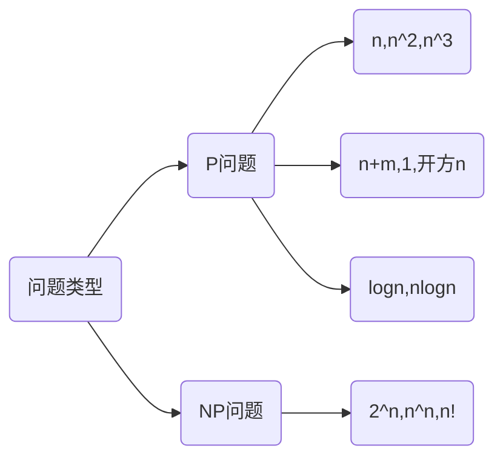

# 算法预备知识

| 名称  | 思想概述  |
|---|---|
| 双指针  | [两根指针遍历集合](newnotes/leetcode/双指针.md)  |
| 二分法  |  [偏移mid指针，缩小问题规模](newnotes/leetcode/二分法.md) |
| DP动态规划  |   |
| 哈希算法  |   |

# 算法评估

!>本节主要回答以下问题 

- [ ] 评估时间复杂度
- [ ] 评估空间复杂度
- [ ] 编程复杂度
- [ ] 思维复杂度
- [ ] 评估平均、最大、最小、最好、最坏、渐进复杂度
- [ ] 移动次数、比较次数
- [ ] 优化复杂度
- [ ] 常见的复杂度有哪些
- [ ] 每类型复杂度都对应有哪些算法？

?>什么是编程复杂度？有什么用？ 
两数组合并，使用双指针算法思维复杂度较低，很容易套模板，但编程复杂度较高，不容易向他人说清楚；使用封装好的API，将list相加，调用sort函数，这样做编程复杂度低，很容易实现

?>如何计算复杂度？ 

- 参考邓俊辉的级数复杂度
- 学会描述复杂度
- 不考虑常数项和系数
  - $O(100n+1000)=O(n)$
  - $O(logn)=O(log(n^2)=O(log4n)$
- 只考虑最高项
  - $O(2^n+n^2)=O(2^n)$
  - $O(n^3+100n^2)=O(n^3)$

?>如何区分$P​$和$NP​$问题

?>常见时间复杂度及对应算法

| 复杂度  | 算法名称  | 用途|
|---|---|--- |
| $O(n)$  | 双指针  | 两数之和、回文、山峰|
|         | 打擂台  |求最大数|
|         | 单调栈  ||
|         | 单调队列  ||
| $O(logn)$ | 二分法  |分割木头|
|  | 辗转相除法 ||
|  | 倍增法 ||
|  | 快速幂算法 ||
| $O(nlogn)$ | 快速排序 ||
|  | 归并排序 ||
|  | 堆排序 ||
| $O(1)$ | 位运算 ||
|  | 哈希表查找 ||
| $O(n^2)$ | 枚举法 ||
|  | 动态规划 ||
|  | Dijkstra ||
| $O(n^3)$ | 枚举法 ||
|  | 动态规划 ||
|  | Floyd ||
| $O(2^n)$ | 与组合有关的搜索问题 ||
| $O(n!)$ | 与排列有关的搜索问题 ||

?>常见优化复杂度的办法

- 使用复杂度更低的算法
- 哈希表
  如用在两数之和中，检验数字是否在数据结构中，时间和空间都为$O(n)$
- 排序
  排序后，数据使用双指针更快
  排序后，用哈希表存储，判断更快

  ?>优化复杂度的经验心得 
  
  1. 读懂题意
  2. 抽象模型，将题目的抽象定义从题目背景中剥离
  3. 根据抽象题意特征，寻找可以解决该问题的算法或数据结构（从上文总结的算法库中找寻、从数据结构库中找寻）
  4. 从最可能的算法和数据结构中，反向检验能否解决该问题
  5. 从最基本的基础算法开始设计
  6. 分析算法复杂度，尝试降低复杂度
  7. 降低复杂度两大途径
     - 选择更好的设计方法，改变算法步骤
     - 找出算法步骤的瓶颈，尝试用数据结构优化算法瓶颈
  8. 反复迭代第6-第7步

# Bugfree技巧

## 编码规范Code Style
!>工作中的编码检查比这些更繁琐，就不在这里一一举例了。

市面上有许多BugFree的书，教我们如何识别代码坏味道，这里存放一个Checklist，用于算法做题中提醒自己要避免的坏味道代码。

| 检查方面  | 解决思路  |
|---|---|
| 函数入口  | 空指针，数组越界，异常捕获  |
| 函数封装  | 子函数提取公共代码  |
| 代码块嵌套  | 一段代码块不超过4层嵌套  |
| 空指针  | 对象判空，长度判0, 对象属性也判空  |
| 数组越界  | 上溢、下溢、循环中读写数组前先判断  |
| 变量命名  |  动词，`is`,`should`,`add`等有意义的词 |
| 空行  |  注释前的`{`要加空行 |
| 空格  |  都好后加空格`int a = 3, b = 4` |
| 空格  | 花括号与运算符之间要加空格`for( int a = 3;...) {}`,`if( a > 3 ) {}`，变量与运算符之间要加空格`a = 3`  |
| 嵌套层级  |  不多于4层，必要时封装成函数 |
| 注释  | 参数注释，返回值注释，关键步骤注释说明  |

## 测试用例
!> 通常考验的是未通过的测试用例积累，以及测试用例的编写能力能给出常见的边界测试用例，如： 
- 空对象null  
- 空串""  
- 均等的数组[1,1,1,1,1,1]  
- 特殊的数组[99,1,1,1,1,98]  

# 面试评价体系

在面试过程中，多位面试官（包括PM、技术和人力等）对候选者进行硬技能和软技能的提问、调查，每一轮都会得出一次面试评价，根据多轮面试评价纵向比对，最终确认是否发放Offer。

## 硬技能
一般工程师包括以下技术指标（以安卓工程师为例）

| 编程平台 | 计算机技术 | 其他           |
| -------- | ---------- | -------------- |
| Java     | 数据结构   | 性能监控及优化 |
| Web      | 设计模式   | 音视频         |
| Flutter  | 算法       | 相机           |
| Android  | 系统设计   | Framework定制  |
| C        | 计算机网络 | Rom定制        |
|          | 操作系统   | 自定义控件     |

## 软技能

逻辑
- 一个问题能否快速想到解决思路和伪代码
- 能否在面试官点出问题后，给出优化方案、优化代码实现

代码质量
- 能否完整写完代码
- 代码风格是否符合大型项目风格，如阿里编码规范、海尔编码规范、谷歌编码规范
- 异常情况考虑
- 安全情况考虑，数据安全，性能安全
- 少用全局变量，多使用自定义对象封装参数和返回值

沟通
- 做题目之前，事先确认题目含义，题目对时间复杂度和空间复杂度的要求
- 未完全理解题目含义前，禁止动手写思路和代码
- 努力思考也做不出来的题目，可以问面试官要提示
- 给了提示也不会，请放弃，避免耽误时间

