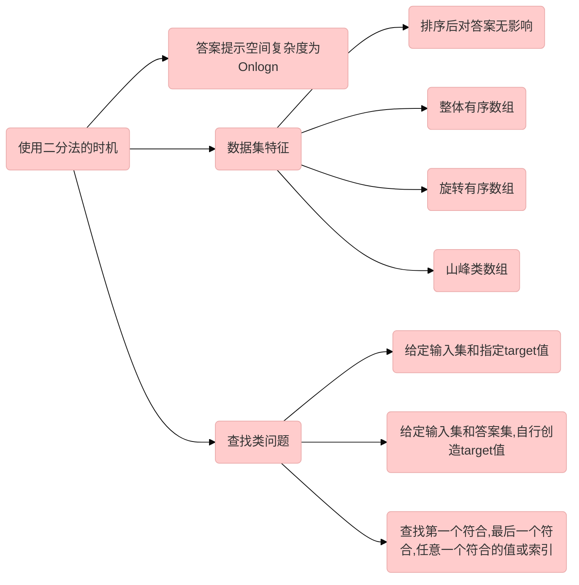
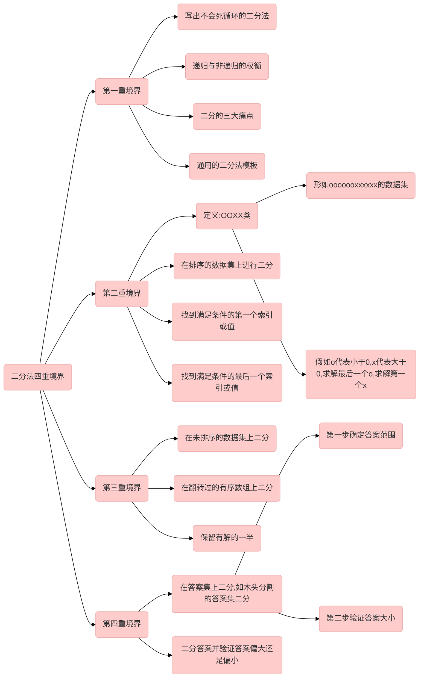

# 二分法

# 二分法使用条件
|出现关键字| 二分法使用概率|
|---|---|
|当⾯试官要求你找⼀个⽐ O(n) 更⼩的时间复杂度算法的时候|99%|
|找到数组中的⼀个分割位置，使得左半部分满⾜某个条件，右半部分不满⾜|100%|
|找到⼀个最⼤/最⼩的值使得某个条件被满⾜|90%|

# 二分法复杂度
- 时间复杂度：$O(logn)$ 
- 空间复杂度：$O(1)$


# 如何判断是否属于二分问题

# 二分法境界


# 二分法基础

| 知识点     | 用途                                                         |
| ---------- | ------------------------------------------------------------ |
| 二分法用途 | 查找目标元素的位置,第一次出现位置，最后一次出现位置<br>查找目标元素是否存在<br> |
| 数组结构   | 输入数据集,可用于二分查询<br>结果数据集，也可以用于二分查询<br> |
| 哈希表结构 | 将输入数据集转化<br>                                         |
| 时间复杂度 | $O(logN)$                                                    |
| 空间复杂度 | $O(N)$                                                       |


# 二分法难点
## 二分思想
二分法思想分为两个部分：

- while循环，不断缩小范围，从n缩小至2，直至只有start和end两个指针
- 在start和end中判断是否符合结果条件的解

?>二分法不仅可以用于划分输入集，也可以划分结果集如分割木头

## 死循环
!>死循环原因是什么？<br>

1. 传统写法是`start<=end`、`start<end`，其中`start`和`end`指针偏比较错误，无法跳出循环。
2. 特殊数组如`[1,1,1,1]`,`mid`在赋值阶段,`mid`与`start`或`end`恒等，导致`start`、`end`无法变化

!>如何避免死循环？<br>

1. `start+1<end`。
2. `mid = start+(end-start)/2`
3. 正确左移或右移

## 正确性
!>如何确保二分法是正确有效的？<br>

保证每次划分，偏移`mid`时，都能**覆盖到正确解**。诸如`start=mid`或`end=mid`

!>为什么`start=mid`，而不是`start=mid+1`；同理为什么`end=mid`，而不是`end=mid-1`；为什么mid默认左移，即`end=mid`?

<br>

赋值`start`、`end`的目的是缩小问题规模，取什么值不重要，只要每次划分能覆盖到正确解即可

!>为什么循环结束后，单独处理`start`和`end`<br>

- 先处理`start`或先处理`end`并无固定顺序
- 取决于题意`求解第一个`、`求解最后一个`、`求解任意一个`


# 典型例题
## 类型1-在输入集找指定target
给定目标值target，要求寻找下标
1. 寻找目标值，给出任意目标值的下标
2. 寻找目标值，给出第一个符合目标值的下标
3. 寻找目标值，给出最后一个符合目标值的下标

## 类型2-在答案集找转化后的target
?> 与类型1的区别是，自己创造target<br>
给定数组，要求找到符合条件的值或下标
1. 山脉序列最大值
2. 山脉数组的峰顶索引


   
# 模板
## 模板四要素
- 初始化：`start=0,end = arrays.length-1,mid =start+(end-start)/2`
- 循环条件：`start+1<end`
- mid移动条件：
  - mid右移条件：`arrays[mid] < target`，移动数值`start = mid`或`start = mid+1`
  - mid左移条件：`arrays[mid]== target`或`arrays[mid]> target `，移动数值`end = mid`或`end = mid-1`
- 兜底条件:
  - 兜底条件：`arrays[start] == target`
  - 兜底条件2：`arrays[end]==target`

## 模板代码

?> 适用于求任意符合条件的位置

```java
class Solution {
    /**
     * @param nums: The integer array.
     * @param target: Target to find.
     * @return: The first position of target. Position starts from 0.
     */
    public int binarySearch(int[] nums, int target) {
        if (nums == null || nums.length == 0) {
            return -1;
        }
        
        int start = 0, end = nums.length - 1;
        while (start + 1 < end) {
            int mid = start + (end - start) / 2;
            if (nums[mid] == target) {
                end = mid;
            } else if (nums[mid] < target) {
                start = mid;
                // or start = mid + 1
            } else {
                end = mid;
                // or end = mid - 1
            }
        }
        
        if (nums[start] == target) {
            return start;
        }
        if (nums[end] == target) {
            return end;
        }
        return -1;
    }
}

```


## 变式1-第一次出现的下标

与模板不同之处：先判断`nums[start] == target`

```java
public class Solution {
    /**
     * @param nums:   The integer array.
     * @param target: Target to find.
     * @return: The first position of target. Position starts from 0.
     */
    public int binarySearch(int[] nums, int target) {
        // write your code here
        if (nums == null || nums.length == 0) {
            return -1;
        }
        int start = 0;
        int end = nums.length - 1;
        while (start + 1 < end) {
            int mid = start + (end - start) / 2;
            if (nums[mid] == target) {
                end = mid;
            } else if (nums[mid] < target) {
                start = mid;
            } else {
                end = mid;
            }
        }
        if (nums[start] == target) {
            return start;
        }
        if (nums[end] == target) {
            return end;
        }
        return -1;

    }
}
```

## 变式2-最后一次出现的位置

与模板不同之处：先判断`nums[right] == target`

```java
public class Solution {
    /**
     * @param nums:   An integer array sorted in ascending order
     * @param target: An integer
     * @return: An integer
     */
    public int lastPosition(int[] nums, int target) {
        // write your code here
        if (nums == null || nums.length == 0) {
            return -1;
        }
        int left = 0;
        int right = nums.length - 1;
        while (left + 1 < right) {
            int mid = left + (right - left) / 2;
            if (nums[mid] == target) {
                left = mid;
            } else if (nums[mid] < target) {
                left = mid;
            } else {
                right = mid;
            }

        }
        if (nums[right] == target) {
            return right;
        }
        if (nums[left] == target) {
            return left;
        }
        return -1;
    }
}
```

