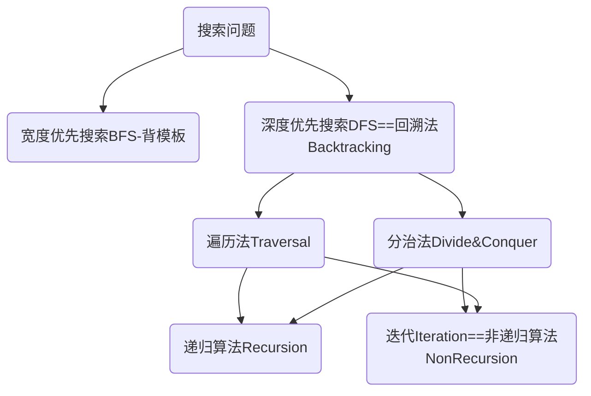

# 分治法

# 前置知识

## 数据结构

|      | 图                 | 树             | 二叉树                                                       |
| ---- | ------------------ | -------------- | ------------------------------------------------------------ |
| 形态 | 由节点和边连接起来 | 树是没有环的图 | 二叉树是每个节点最多有2个子树的树结构                        |
| 分类 | 有向；无向         | 。。           | 完全二叉树、完美二叉树、只有左子树、只有右子树、平衡二叉树、二叉搜索树 |


## 一个问题:分治法与二分法有什么区别？

- 分治法，将数据按规模分别两边，两边都要处理
- 二分法，将数据按规模长度分为两半，只处理一半，另一半不处理
## 一个问题：分治法与动态规划有什么区别？


## 递归Recursion

### 递归三要素是什么？[^1]

- 递归的定义


- 递归的出口的返回值
- 递归的拆解

### 递归函数与递归算法的区别是什么？

递归函数：程序的实现方式，函数的自我调用

递归算法：算法思想，大问题的结果依赖于小问题的结果，可以采取递归函数求解小问题，也可以采取其他方式求解小问题。

> 除了算法刷题场景之外，其他场景提到的递归都是指函数调用即递归函数。仅在算法刷题中，才会经常提到递归算法。


## 深搜Depth First Search

DFS有多种实现方式，具体参考后面的章节。DFS可以使用递归函数，也可以使用Stack进行操作。

> DFS与BFS不同：
>
> - DFS优先搜索更深的节点，而不是像BFS那样，按照宽度搜索同一层级节点
> - DFS通常需要递归，BFS不需要递归

## 回溯法

回溯法：就是DFS法

回溯操作：指的是这样的一个操作过程：“递归函数在回到上一层递归调用处的时候，一些参数需要改回到调用前的值”。它是指让状态参数回到之前的值，递归调用前做了什么改动，递归调用之后都改回来。

## 一个问题：遍历法和分治法有什么区别？

> 假设一个任务：人口普查局长要统计全国人口

| 区别           | 遍历                                                         | 分治                                                         |
| -------------- | ------------------------------------------------------------ | ------------------------------------------------------------ |
| 任务执行过程   | 一个人拿着笔记本记录并走遍所有节点                           | 分配小弟去做子任务，自己将小弟结果进行汇总                   |
| 任务主要执行者 | 自己                                                         | 小弟                                                         |
| 借助工具       | 通过前序 / 中序 / 后序的某种遍历，游走整棵树，通过一个全局变量或者传递的参数来记录这个过程中所遇到的点和需要计算的结果。 | 先让左右子树去解决同样的问题，运用return value返回子问题的结果，然后得到结果之后，再整合为整棵树的结果。 |
| 区别           | 递归函数没有return逻辑                                       | 递归函数有return 逻辑                                        |
| 本质           |                                                              | 二叉树的分治本质是做遍历                                     |
| 联系           | 有可能用到递归                                               | 有可能用到递归                                               |

> 遗留问题：二叉树的分治是在做二叉树的什么遍历？先序？中序？还是后序？
>
> 答：都可以

根治递归、dfs、回溯、遍历、分治、迭代




## 一个问题：什么样的数据结构适合分治法？


|      | 二叉树                                                       | 数组                                        |
| ---- | ------------------------------------------------------------ | ------------------------------------------- |
| 描述 | 整棵树的左子树和右子树都是二叉树。二叉树的大部分问题都可以用分治法解决 | 一个大数组可以拆分为若干个不相交的子数组    |
| 难点 | 遇到二叉树结构，思考左右子树在该问题上的结果有什么联系       | 如何不相交拆分子数组;<br>如何提高拆分的效率 |
| 举例 | [二叉树求值求路径-具有最大平均数的子树](https://www.lintcode.com/problem/597/)<br>[二叉树结构变化-翻转二叉树](https://www.lintcode.com/problem/175/) | 归并排序、快速排序都是分治思想              |


# 分治法三类考察场景


| 类型名称             | 常见关键字                         | 题型                           |
| -------------------- | ---------------------------------- | ------------------------------ |
| 二叉树上求值、求路径 | 最大值、最小值、平均值、求和、路径 | 最小子树<br>最近公共祖先II<br> |
| 二叉树结构变化       |                                    | 翻转二叉树<br>将二叉树拆成链表 |
| 二叉搜索树           |                                    |                                |


# 二叉树最小子树

[题目链接](https://www.lintcode.com/problem/596/?_from=collection&fromId=161) 

解答链接

## 一个问题：二叉树有多少颗子树

答：$O（n）$,n为节点个数

## 一个问题：二叉树的高度有多少情况

- 一般是O（h）
- 最坏是O（logn）
- 最好是xx

## 全局变量-分治法

优点：

- 函数三要素清晰可实现

缺点：

- 函数不纯粹，有bug
- 不利于多线程、对共享变量加锁带来效率下降

## 局部变量-分治法

优点：

- 没有全局变量
- 用自定义对象定义了返回值，包装了每一层的结果

缺点：

- 编程复杂度较高

# 二叉搜索树BST


**二叉搜索树定义：**

- 左子树都比根节点小
- 右子树都不小于根节点

**二叉搜索树效果：**

- 中序遍历的结果是不下降的序列

**二叉搜索树的性质：**

- 二叉树的中序遍历是否下降，跟是不是二叉搜索树没有关系
- BST的高度是$O(h)$,最好是$Ologn$，最坏是$O(n)$

?> 只有平衡二叉树的高度才是O(logn);

特殊情况

红黑树也是一个特殊的BST

- 红黑树增删改查的效率为OLogN
- 查找最值的效率为OLogN
- 找比某个数大的最小值、比某个数小的最大值效率为OLogN
- HashMap的实现使用了TreeMap和LinkedList
- 面试不需要掌握，写出来要200行，没人能写完。

# 题型

## BST中第K小的元素


# 二叉树分治法模板

碰到二叉树的问题，先思考整棵树针对该问题的结果是什么；

再思考我那天的结果与每个节点的左右子树有什么联系。

```java

public 返回结果类型 divideConquer(TreeNode root) {
        if (root == null) {
            // 回退情况
        }

        if (root.left == null && root.right == null) {
            // 处理叶子应该返回的结果
            // 如果叶子的返回结果，可以通过两个空节点的返回结果得到
            // 就可以省略这一段代码
        }

        左子数返回结果 = divideConquer(root.left)
        右子数返回结果 = divideConquer(root.right)
        整颗树的结果 = 按照一定方法合并左右子树的结果
        return 整棵树的结果
    }
```


[^1]: 九章算法2020班令狐冲老师对递归三要素的定义-分治法章节 