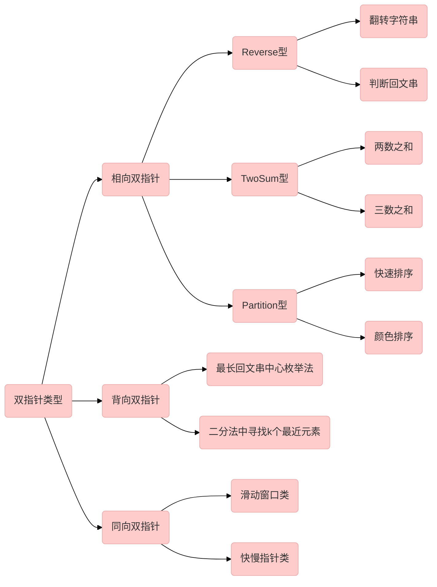

# 双指针

# 常见题型

| 标题 | 介绍 |
| ------------------------------------------------------------ | -------------------------------------------------- |
| [LeetCode两数之和](https://juejin.cn/post/6953097638996607012) | 简单的双指针入门                                   |
| [LeetCode两数之和 II](https://juejin.cn/post/6953099826187730980) | 简单的双指针入门                                   |
| [LeetCode两数之和 III-](https://juejin.cn/post/6953101100610388005)输入有序数组 | 简单的双指针入门                                   |
| [LeetCode两数和-小于或等于目标值](https://juejin.cn/post/6953104572814458911) | 简单的双指针入门                                   |
| [LeetCode两数之和 III-数据结构设计](https://juejin.cn/post/6953103368797552676) | 简单的双指针提升，数据结构综合                     |
| [LeetCode两数和的最接近值](https://juejin.cn/post/6953107878093799460) | 简单的双指针提升，打擂台综合                       |
| [LeetCode两数之和 - 不同组成](https://juejin.cn/post/6953110609940447246) | 简单的双指针提升，去重判等边界处理<br>异常情况综合 |
| [LeetCode三数之和](https://juejin.cn/post/6953113318978486285) | 简单的双指针提升，换元综合                         |
| [LeetCode有效三角形的个数（三角形计数）](https://juejin.cn/post/6953116396649709581) | 较难的双指针应用，抽象问题综合                     |
| [LeetCode颜色分类](https://juejin.cn/post/6953118384196173860) | 较难的双指针应用，抽象问题综合                     |
| [LeetCode交错正负数](https://juejin.cn/post/6953123605051867149) | 较难的双指针应用，划分综合                         |
| [LeetCode移动零](https://juejin.cn/post/6953126711751868423) | 简单的双指针提升，划分综合                                   |
| [LeetCode无序数组K小元素](https://juejin.cn/post/6953128801698545672) | 较难的双指针应用，三指针拓展，划分综合             |
| [LeetCode数组划分](https://juejin.cn/post/6953131036083486756) | 较难的双指针应用，划分综合                         |
| [LeetCode 排序数组](https://juejin.cn/post/6953138192191062029) | 较难的双指针应用，划分综合，排序综合               |

其他题目
  - [两数之和](newnotes/leetcode/两数之和.md)
  - [两数之和III-数据结构设计](newnotes/leetcode/两数之和III-数据结构设计.md)
  - [两数之和-不同组成](newnotes/leetcode/两数之和-不同组成.md)
  - [颜色分类](newnotes/leetcode/颜色分类.md)
  - [三数之和](newnotes/leetcode/三数之和.md)
  - [数组划分](newnotes/leetcode/数组划分.md)
  - [链表的中点](newnotes/leetcode/链表的中间结点.md)
  - [移动零](newnotes/leetcode/移动零.md)
  - [两数和II-输入已排序的数组](newnotes/leetcode/两数之和II输入已排序数组.md)
  - [两数和-小于或等于目标值](newnotes/leetcode/两数和-小于或等于目标值.md)
  - [两数和的最接近值](newnotes/leetcode/两数和的最接近值.md)
  - [两数之和II](newnotes/leetcode/两数之和II.md)
  - [无序数组K小元素](newnotes/leetcode/无序数组K小元素.md)
  - [三角形计数](newnotes/leetcode/三角形计数.md)
  - [交错正负数](newnotes/leetcode/交错正负数.md)
  - [第k大元素](newnotes/leetcode/第k大元素.md)
  - [合并有序数组](newnotes/leetcode/合并有序数组.md)

# 双指针复杂度
- 时间复杂度$O(n)$,与最内存循环主体执行此书有关；与多少重循环无关
- 空间复杂度$O(1)$，两个指针占据的内存为常数

# 双指针使用条件
|出现关键字|双指针使用概率|
|---|---|
|滑动窗⼝| 90%|
|时间复杂度要求 O(n)| 80% |
|要求原地操作，只可以使⽤交换，不能使⽤额外空间| 80% |
|有⼦数组 subarray /⼦字符串 substring 的关键词| 50% |
|有回⽂ Palindrome 关键词|50%|

# 双指针类型


## 复杂度小测验
式1
```java
int a = 0;
for (int i = 0; i < n; i++){
	for (int j = 0; j < n; j++){
		a += 1;
	}
}
```
!>1+2+3+…+n=n(n-1)/2=n^2

式2

```java
int a = 0;
for (int i = 1; i < n; i++){
	for (int j = 1; j < n / i; j++){
		a += 1;
	}
}

```
!>T(n) = n + n/2 + n/3 + n/4 + ... + n/n，而根据数学知识，这一部分求和的结果的下界是nln(n)。因此时间复杂度是O(nlogn)级别的


# 双指针模板
## 相向双指针模板
```java
    // 相向双指针(patition in quicksort) 2
    public void patition(int[] A, int start, int end) {
        if (start >= end) {
            return;
        }
        int left = start, right = end;
        // key point 1: pivot is the value, not the index
        int pivot = A[(start + end) / 2];
        // key point 2: every time you compare left & right,
        // left <= right not left < right
        while (left <= right) {
            while (left <= right && A[left] < pivot) {
                left++;
            }
            while (left <= right && A[right] > pivot) {
                right--;
            }
            if (left <= right) {
                int temp = A[left];
                A[left] = A[right];
                A[right] = temp;
                left++;
                right--;
            }
        }
    }
}
```

## 背向双指针模板
```java
    // 背向
        left = position;
        right = position+1;
        while(left >= 0 && right< length){
            if(可以停下来了){
                break;
            }
            left--;
            right++;
        }

```

## 同向双指针模板
```java
        // 同向
        int j = 0;
        for(int i = 0 ;i < n;i++){
            // 不满足则循环到满足搭配为止
            while(j < n && i到j之间不满足条件){
                j += 1;
            }
            if(i 到 j之间满足条件){
                处理i，j这次搭配
            }
        }
```

## 合并双指针模板

```java
    // 需要创建一个新的list，而不是在list1和list2上改动
    public ArrayList<Integer> merge(ArrayList<Integer> list1, ArrayList<Integer> list2) {
        // 需要创建一个新的list，而不是在list1和list2上改动
        ArrayList<Integer> newList = new ArrayList<>();
        int i = 0;
        int j = 0;
        while (i < list1.size() && j < list2.size()) {
            if (list1.get(i) < list2.get(j)) {
                newList.add(list1.get(i));
                i++;
            } else {
                newList.add(list2.get(j));
                j++;
            }
        }

        // 合并上下的数到新集合
        while (i < list1.size()) {
            newList.add(list1.get(i));
            i++;
        }
        while (j < list2.size()) {
            newList.add(list2.get(j));
            j++;
        }
        return newList;
    }
```

# 同向双指针
## 同向双指针定义
```java
[1,2,3,4,5,6,..]
 L R
```
## 同向双指针典型例题
暂无
# 背向双指针
## 背向双指针定义
```java
[1,2,3,4,5,6,..]
     <-L R->
```
## 背向双指针典型例题
最长回文串
# 相向双指针

## 相向双指针定义
```java
[1,2,3,4,5,6,..]
 L ->      <- R
```
## 相向双指针典型例题
判断回文串
翻转字符串
两数之和
三数之和
快速排序
颜色排序


